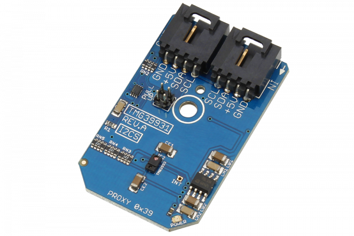

[](https://store.ncd.io/product/tmg39931-light-sensor-gesture-color-als-and-proximity-sensor-i2c-mini-module/).

#  TMG39931

The TMG39931 features advanced gesture detection, proximity detection, digital ambient light sensor (ALS), Color Sensor (RGBC), and optical pattern generation/transmission.The slim modular package incorporates an IR LED and factory calibrated LED driver.Gesture detection utilizes four directional photodiodes to sense reflected IR energy (sourced by the integrated LED) to convert physical motion information (i.e. velocity, direction and distance) to digital information.
This Device is available from www.ncd.io 

[SKU: TMG39931]

(https://store.ncd.io/product/tmg39931-light-sensor-gesture-color-als-and-proximity-sensor-i2c-mini-module/)
This Sample code can be used with Raspberry Pi.

Hardware needed to interface TMG39931 light,gesture,color,ALS proximity sensor With Raspberry Pi :
1. <a href="https://store.ncd.io/product/tmg39931-light-sensor-gesture-color-als-and-proximity-sensor-i2c-mini-module/">TMG39931 light,gesture,color,ALS proximity sensor</a>
2.  <a href="https://store.ncd.io/product/i2c-shield-for-raspberry-pi-3-pi2-with-outward-facing-i2c-port-terminates-over-hdmi-port/">Raspberry Pi I2C Shield</a>
3. <a href="https://store.ncd.io/product/i%C2%B2c-cable/">I2C Cable</a>

## Python
Download and install smbus library on Raspberry pi. Steps to install smbus are provided at:

https://pypi.python.org/pypi/smbus-cffi/0.5.1

Download (or git pull) the code in pi. Run the program.

```cpp
$> python TMG39931.py
```
The lib is a sample library, you will need to calibrate the sensor according to your application requirement.
